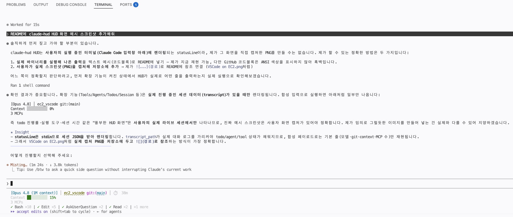

# EC2 VSCode Server - Secure Architecture

AWS CDK / CloudFormation을 사용하여 보안이 강화된 VSCode Server + Claude Code 개발 환경을 배포합니다.

## Architecture


```
User ──HTTPS──> CloudFront ──HTTP:80──> ALB (Custom Header) ──HTTP:8888──> EC2 (Private Subnet)
```

### 구성 요소

| 구성 요소 | 설명 |
|---------|------|
| VPC | 10.254.0.0/16 (신규 생성) 또는 기존 VPC 선택 |
| Public Subnet A/B | ALB, NAT Gateway |
| Private Subnet A/B | VSCode Server EC2 |
| CloudFront | HTTPS 종료, ALB 오리진 |
| ALB | CloudFront Prefix List + Custom Header 검증 |
| EC2 | code-server + Claude Code + Kiro CLI |

### 보안 기능

- **CloudFront Prefix List**: ALB Security Group에서 CloudFront origin-facing IP만 허용
- **X-Custom-Secret Header**: CloudFront에서 ALB로 전달되는 커스텀 헤더로 직접 ALB 접근 차단 (403)
- **Private Subnet**: VSCode Server가 Private Subnet에 배치되어 직접 인터넷 노출 없음
- **SSM VPC Endpoints**: Private Subnet에서 SSM Session Manager 접근 (SSH 불필요)
- **EBS 암호화**: 100GB gp3 볼륨 암호화 활성화

### EC2 UserData 설치 항목

| 항목 | 버전 |
|------|------|
| AWS CLI | v2 (latest) |
| Node.js | 20 (nodesource + fnm fallback) |
| Python3 + pip | boto3, click, bedrock-agentcore |
| code-server | v4.126.0 |
| Claude Code CLI | latest (@anthropic-ai/claude-code) |
| Claude Code Extension | Anthropic.claude-code (Open VSX) |
| Kiro CLI | latest |
| Docker | latest |
| uv | latest (Python package manager) |
| CloudWatch Agent | latest |
| SSM Plugin | latest |

## 프로젝트 구조

```
.
├── vscode_server_secure.yaml     # 메인 CloudFormation 템플릿
├── deploy_vscode.sh              # 대화형 CDK 배포 스크립트
├── README.md
├── VSCode on EC2.png
│
├── infra-cdk/                    # CDK TypeScript 프로젝트
│   ├── bin/app.ts                #   App 진입점
│   ├── lib/vscode-stack.ts       #   메인 스택 (VPC, ALB, EC2, CloudFront, SSM)
│   ├── package.json
│   ├── tsconfig.json
│   └── cdk.json
│
├── claude-code-setup/                # VSCode Server 내 Claude Code 환경 설정
│   ├── 01-setup-bedrock-env.sh   #   Bedrock 환경변수 설정
│   ├── 02-setup-vscode-settings.sh #  VS Code Extension 설정
│   ├── 03-setup-plugins-and-mcp.sh #  플러그인 + MCP 서버 설치
│   ├── 04-update-claude.sh       #   Claude Code 업데이트
│   ├── 05-setup-custom-plugin.sh #   커스텀 플러그인 설치
│   ├── 06-switch-mode.sh         #   구독형 ↔ Bedrock API 모드 전환
│   ├── 07-setup-aws-skills.sh    #   AWS 스킬 36개 설치
│   ├── 08-setup-claude-hud.sh    #   claude-hud statusLine HUD 설치/설정
│   ├── mcp-toggle.sh             #   MCP 서버 ON/OFF TUI
│   └── CLAUDE_SETUP.md           #   상세 설정 가이드
│
├── kiro-cli-setup/              # VSCode Server 내 Kiro CLI 환경 설정
│   ├── 01-setup-auth.sh          #   브라우저/디바이스 플로우 인증
│   ├── 02-setup-model.sh         #   기본 모델 선택 (auto/Claude/서드파티)
│   ├── 03-setup-mcp-servers.sh   #   MCP 서버 설정 (mcp.json)
│   ├── 04-update-kiro.sh         #   Kiro CLI 업데이트
│   ├── 05-install-skills.sh      #   Kiro CLI 스킬 설치 (36개)
│   └── KIRO_SETUP.md             #   상세 설정 가이드
│
├── templates/                    # 대체 CloudFormation 템플릿
│   ├── ec2vscode.yaml            #   기본 VPC 단순 배포
│   ├── ec2vscode_ubuntu.yaml     #   Ubuntu 기반
│   ├── vscode_existing_vpc.yaml  #   기존 VPC 배포
│   ├── vscode_server_ecs.yaml    #   ECS 기반
│   ├── vscode_server_multiuser.yaml # 멀티유저
│   ├── vscode_user_stack.yaml    #   유저별 Nested Stack
│   └── vscode_secure.yml         #   보안 강화 (S3 중첩)
│
└── legacy/                       # 레거시 헬퍼 스크립트
    ├── defaultvpcid.sh
    ├── deploy_vscode_existing_vpc.sh
    └── ...
```

## Prerequisites

- AWS CLI 설치 및 적절한 권한 (CloudFormation, EC2, ELB, CloudFront, IAM, SSM, S3)
- Node.js 20+ / npm
- (CDK 배포 시) CDK CLI 자동 설치됨

## Quick Start (CDK 배포 - 권장)

### 1. Repository Clone

```bash
git clone https://github.com/whchoi98/ec2_vscode.git
cd ec2_vscode
```

### 2. 대화형 배포 실행

```bash
bash deploy_vscode.sh
```

대화형으로 다음을 선택합니다:
- **계정**: 현재 자격 증명 / AWS 프로파일 / Access Key 직접 입력
- **리전**: 서울, 도쿄, 버지니아 등 12개 리전
- **VPC**: 새 VPC 생성 (10.254.0.0/16) 또는 기존 VPC 선택
- **인스턴스 타입**: ARM64 Graviton (기본 t4g.2xlarge) 또는 x86_64
- **비밀번호**: VSCode Server 접속 비밀번호 (8자 이상)

배포 완료 후 CloudFront URL과 SSM 접속 명령이 출력됩니다.

### 3. 접속

```bash
# 방법 1: 브라우저 (CloudFront URL)
# 배포 완료 시 출력된 URL로 접속, 비밀번호 입력

# 방법 2: SSM Session Manager
aws ssm start-session --target <InstanceId> --region <Region>
```

## Quick Start (CloudFormation 직접 배포)

```bash
# CloudFront Prefix List ID 조회
CF_PREFIX_LIST_ID=$(aws ec2 describe-managed-prefix-lists \
  --query "PrefixLists[?PrefixListName=='com.amazonaws.global.cloudfront.origin-facing'].PrefixListId" \
  --output text)

# 스택 배포
aws cloudformation deploy \
  --stack-name mgmt-vpc \
  --template-file vscode_server_secure.yaml \
  --capabilities CAPABILITY_NAMED_IAM \
  --parameter-overrides \
    CloudFrontPrefixListId=$CF_PREFIX_LIST_ID \
    VSCodePassword="YourPassword123" \
  --region ap-northeast-2

# CloudFront URL 확인
aws cloudformation describe-stacks \
  --stack-name mgmt-vpc \
  --query "Stacks[0].Outputs[?OutputKey=='CloudFrontURL'].OutputValue" \
  --output text --region ap-northeast-2
```

## Parameters

| 파라미터 | 기본값 | 설명 |
|---------|-------|------|
| CloudFrontPrefixListId | (필수) | CloudFront origin-facing managed prefix list ID |
| InstanceType | t4g.2xlarge | EC2 인스턴스 타입 (ARM64/x86_64) |
| VSCodePassword | (필수) | VSCode Server 비밀번호 (최소 8자) |
| ExistingVpcId | (빈값) | 기존 VPC ID (CDK 배포 시, 빈값이면 새 VPC 생성) |

## Outputs

| Output | 설명 |
|--------|------|
| CloudFrontURL | VSCode Server 접속 URL (HTTPS) |
| InstanceId | EC2 Instance ID (SSM 접속용) |
| PrivateIP | EC2 Private IP |
| PublicALBEndpoint | ALB DNS (직접 접근 불가 - 403) |
| CustomHeaderSecret | CloudFront -> ALB 검증용 시크릿 |

## EC2 IAM Role

CDK 배포 시 EC2 인스턴스에 다음 IAM Role이 생성됩니다.

| 항목 | 값 |
|------|-----|
| Role 이름 | `VscodeServerStack-VSCode-Role` |
| 사용 주체 | EC2 인스턴스 (VSCode Server) |

**연결된 정책:**

| 정책 | 용도 |
|------|------|
| `AmazonSSMManagedInstanceCore` | SSM Session Manager 접속 |
| `CloudWatchAgentServerPolicy` | CloudWatch 모니터링 및 로그 수집 |

**AdministratorAccess 추가 (전체 권한):**

```bash
aws iam attach-role-policy \
  --role-name VscodeServerStack-VSCode-Role \
  --policy-arn arn:aws:iam::aws:policy/AdministratorAccess
```

> AdministratorAccess는 전체 AWS 계정에 대한 모든 작업을 허용합니다. 보안이 중요한 환경에서는 필요한 정책만 개별 추가하세요.

## 스택 삭제

### CDK 배포 삭제

```bash
# 방법 1: CDK CLI
cd ~/ec2_vscode/infra-cdk
npm install
npx cdk destroy VscodeServerStack --region <Region> --force

# 방법 2: AWS CLI
aws cloudformation delete-stack --stack-name VscodeServerStack --region <Region>
```

> CloudFront 배포가 포함되어 있어 삭제까지 10~15분 소요될 수 있습니다.

### CDK Bootstrap 리소스 정리 (선택)

스택 삭제 후에도 CDK bootstrap 리소스(`CDKToolkit` 스택, S3 버킷)는 남아있습니다.
더 이상 CDK를 사용하지 않는다면 정리할 수 있습니다.

```bash
# S3 버킷 비우기 + 삭제
aws s3 rm s3://cdk-hnb659fds-assets-<AccountId>-<Region> --recursive
aws s3api delete-bucket --bucket cdk-hnb659fds-assets-<AccountId>-<Region> --region <Region>

# CDKToolkit 스택 삭제
aws cloudformation delete-stack --stack-name CDKToolkit --region <Region>
```

### CloudFormation 직접 배포 삭제

```bash
aws cloudformation delete-stack --stack-name mgmt-vpc --region ap-northeast-2
```

## Claude Code + Amazon Bedrock 설정

VSCode Server 배포 후 Claude Code를 Amazon Bedrock과 연동하기 위한 설정 스크립트입니다.
자세한 내용은 [claude-code-setup/CLAUDE_SETUP.md](claude-code-setup/CLAUDE_SETUP.md)를 참조하세요.

### 빠른 시작

```bash
# 1. Bedrock 환경변수 설정
bash claude-code-setup/01-setup-bedrock-env.sh
source ~/.bashrc

# 2. VS Code 확장 설정 (code-server 사용 시)
bash claude-code-setup/02-setup-vscode-settings.sh

# 3. 플러그인 + MCP 서버 설치
bash claude-code-setup/03-setup-plugins-and-mcp.sh

# 4. Claude Code 업데이트 (선택)
bash claude-code-setup/04-update-claude.sh

# 5. 커스텀 플러그인 설치 (선택)
bash claude-code-setup/05-setup-custom-plugin.sh

# 6. AWS 스킬 36개 설치 (선택)
bash claude-code-setup/07-setup-aws-skills.sh

# 7. claude-hud statusLine HUD 설치/설정 (선택)
bash claude-code-setup/08-setup-claude-hud.sh
```

### 스크립트 목록

| 순서 | 스크립트 | 설명 |
|------|---------|------|
| 01 | `01-setup-bedrock-env.sh` | Bedrock 환경변수 (~/.bashrc) 설정 |
| 02 | `02-setup-vscode-settings.sh` | VS Code Extension (code-server) 설정 |
| 03 | `03-setup-plugins-and-mcp.sh` | 플러그인 49개(공식 48개 + AWS 1개) + AWS MCP 서버 3개 설치 |
| 04 | `04-update-claude.sh` | Claude Code CLI 업데이트 |
| 05 | `05-setup-custom-plugin.sh` | 커스텀 플러그인 (project-init) 설치 |
| 06 | `06-switch-mode.sh` | 구독형 ↔ Bedrock API 모드 전환 |
| 07 | `07-setup-aws-skills.sh` | AWS 스킬 36개 설치 (~/.claude/skills) |
| 08 | `08-setup-claude-hud.sh` | claude-hud 플러그인 설치 + statusLine HUD 설정 (~/.claude/settings.json) |
| - | `mcp-toggle.sh` | MCP 서버 ON/OFF 인터랙티브 TUI |

### claude-hud HUD 화면 예시

`08-setup-claude-hud.sh` 실행 후 Claude Code를 재시작하면 입력창 아래에 HUD가 표시됩니다.



기본으로 모델명·git 브랜치·컨텍스트 사용률이 표시되고, `08-setup-claude-hud.sh`가 켜는 확장 항목이 함께 나타납니다:

- **세션 이름** — `/rename`으로 지정한 제목 또는 자동 생성된 세션 슬러그
- 세션 경과 시간(⏱)과 MCP 개수
- 실행한 도구 활동 (예: `✓ Bash ×10`, `✓ Edit ×5`)
- 서브에이전트·Todo 진행률

각 항목은 해당 데이터가 있을 때 표시됩니다.

## Kiro CLI 설정

VSCode Server 배포 후 Kiro CLI 환경을 설정하기 위한 스크립트입니다.
자세한 내용은 [kiro-cli-setup/KIRO_SETUP.md](kiro-cli-setup/KIRO_SETUP.md)를 참조하세요.

### 빠른 시작

```bash
# 1. 인증 (브라우저 / 디바이스 플로우 로그인)
bash kiro-cli-setup/01-setup-auth.sh
#    원격 서버(SSH)에서는 아래 명령으로 디바이스 플로우 로그인 권장:
#    kiro-cli login --use-device-flow

# 2. 기본 모델 설정 (auto / Claude Opus·Sonnet·Haiku / 서드파티)
bash kiro-cli-setup/02-setup-model.sh

# 3. MCP 서버 설정
bash kiro-cli-setup/03-setup-mcp-servers.sh

# 4. Kiro CLI 업데이트 (선택)
bash kiro-cli-setup/04-update-kiro.sh

# 5. Kiro CLI 스킬 설치 (선택)
bash kiro-cli-setup/05-install-skills.sh
```

### 스크립트 목록

| 순서 | 스크립트 | 설명 |
|------|---------|------|
| 01 | `01-setup-auth.sh` | 브라우저 기반 인증 (IAM Identity Center / Builder ID / GitHub 등). 원격 서버는 `kiro-cli login --use-device-flow` 사용 |
| 02 | `02-setup-model.sh` | 기본 모델 선택 (`auto` 기본값, Claude Opus/Sonnet/Haiku, 서드파티 모델) |
| 03 | `03-setup-mcp-servers.sh` | MCP 서버 2개 설정 (~/.kiro/settings/mcp.json) — Terraform, Bedrock AgentCore |
| 04 | `04-update-kiro.sh` | Kiro CLI 업데이트 (ARM64/x86_64 자동 감지) |
| 05 | `05-install-skills.sh` | Kiro CLI 스킬 36개 설치 (`--local`로 프로젝트 단위 설치 가능) |

> **인증 방식 변경**: Kiro CLI는 Bedrock 베어러 토큰 환경변수가 아니라 브라우저/디바이스 플로우 로그인을 사용합니다.
>
> **MCP 서버 2개**: AWS API·Cost Explorer·Pricing·Diagram 도구는 Kiro CLI에 빌트인되어 있어 `core-mcp-server`가 불필요합니다. Terraform·Bedrock AgentCore MCP 서버만 등록됩니다.
>
> **스킬**: 설치 후 `kiro-cli chat --agent powers`로 스킬이 포함된 `powers` 에이전트를 사용하거나, 채팅 중 `/agent powers`로 전환할 수 있습니다. 기본 에이전트로 지정하려면 `kiro-cli settings chat.defaultAgent powers`.
