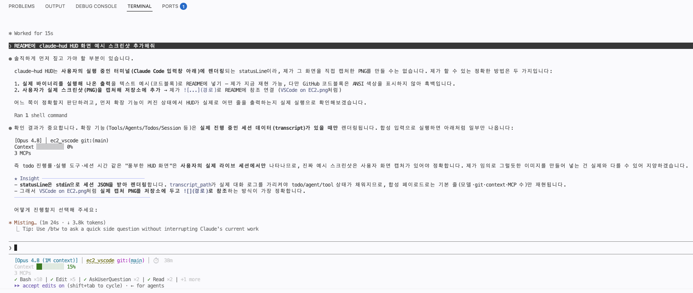

# EC2 VSCode Server - Secure Architecture

AWS CDK / CloudFormation을 사용하여 보안이 강화된 VSCode Server + Claude Code 개발 환경을 배포합니다.

## Architecture


```
User ──HTTPS──> CloudFront ──HTTP:80──> ALB (Custom Header) ──HTTP:8888──> EC2 (Private Subnet)
```

### 구성 요소

| 구성 요소 | 설명 |
|---------|------|
| VPC | 10.254.0.0/16 (신규 생성) 또는 기존 VPC 선택 |
| Public Subnet A/B | ALB, NAT Gateway |
| Private Subnet A/B | VSCode Server EC2 |
| CloudFront | HTTPS 종료, ALB 오리진 |
| ALB | CloudFront Prefix List + Custom Header 검증 |
| EC2 | code-server + Claude Code + Kiro CLI |

### 보안 기능

- <strong>CloudFront Prefix List</strong>: ALB Security Group에서 CloudFront origin-facing IP만 허용
- <strong>X-Custom-Secret Header</strong>: CloudFront에서 ALB로 전달되는 커스텀 헤더로 직접 ALB 접근 차단 (403)
- <strong>Private Subnet</strong>: VSCode Server가 Private Subnet에 배치되어 직접 인터넷 노출 없음
- <strong>SSM VPC Endpoints</strong>: Private Subnet에서 SSM Session Manager 접근 (SSH 불필요)
- <strong>EBS 암호화</strong>: 100GB gp3 볼륨 암호화 활성화

### EC2 UserData 설치 항목

| 항목 | 버전 |
|------|------|
| AWS CLI | v2 (latest) |
| Node.js | 20 (nodesource + fnm fallback) |
| Python3 + pip | boto3, click, bedrock-agentcore |
| code-server | v4.126.0 |
| Claude Code CLI | latest (@anthropic-ai/claude-code) |
| Claude Code Extension | Anthropic.claude-code (Open VSX) |
| Kiro CLI | latest |
| Docker | latest |
| uv | latest (Python package manager) |
| CloudWatch Agent | latest |
| SSM Plugin | latest |

## 프로젝트 구조

```
.
├── vscode_server_secure.yaml     # 메인 CloudFormation 템플릿
├── deploy_vscode.sh              # 대화형 CDK 배포 스크립트
├── README.md
├── VSCode on EC2.png
│
├── infra-cdk/                    # CDK TypeScript 프로젝트
│   ├── bin/app.ts                #   App 진입점
│   ├── lib/vscode-stack.ts       #   메인 스택 (VPC, ALB, EC2, CloudFront, SSM)
│   ├── package.json
│   ├── tsconfig.json
│   └── cdk.json
│
├── claude-code-setup/                # VSCode Server 내 Claude Code 환경 설정
│   ├── 01-setup-bedrock-env.sh   #   Bedrock 환경변수 설정
│   ├── 02-setup-vscode-settings.sh #  VS Code Extension 설정
│   ├── 03-setup-plugins-and-mcp.sh #  플러그인 + MCP 서버 설치
│   ├── 04-update-claude.sh       #   Claude Code 업데이트
│   ├── 05-setup-custom-plugin.sh #   커스텀 플러그인 설치
│   ├── 06-switch-mode.sh         #   구독형 ↔ Bedrock API 모드 전환
│   ├── 07-setup-aws-skills.sh    #   AWS 스킬 36개 설치
│   ├── 08-setup-claude-hud.sh    #   claude-hud statusLine HUD 설치/설정
│   ├── mcp-toggle.sh             #   MCP 서버 ON/OFF TUI
│   └── CLAUDE_SETUP.md           #   상세 설정 가이드
│
├── kiro-cli-setup/              # VSCode Server 내 Kiro CLI 환경 설정
│   ├── 01-setup-auth.sh          #   브라우저/디바이스 플로우 인증
│   ├── 02-setup-model.sh         #   기본 모델 선택 (auto/Claude/서드파티)
│   ├── 03-setup-mcp-servers.sh   #   MCP 서버 설정 (mcp.json)
│   ├── 04-update-kiro.sh         #   Kiro CLI 업데이트
│   ├── 05-install-skills.sh      #   Kiro CLI 스킬 설치 (36개)
│   └── KIRO_SETUP.md             #   상세 설정 가이드
│
├── templates/                    # 대체 CloudFormation 템플릿
│   ├── ec2vscode.yaml            #   기본 VPC 단순 배포
│   ├── ec2vscode_ubuntu.yaml     #   Ubuntu 기반
│   ├── vscode_existing_vpc.yaml  #   기존 VPC 배포
│   ├── vscode_server_ecs.yaml    #   ECS 기반
│   ├── vscode_server_multiuser.yaml # 멀티유저
│   ├── vscode_user_stack.yaml    #   유저별 Nested Stack
│   └── vscode_secure.yml         #   보안 강화 (S3 중첩)
│
└── legacy/                       # 레거시 헬퍼 스크립트
    ├── defaultvpcid.sh
    ├── deploy_vscode_existing_vpc.sh
    └── ...
```

## Prerequisites

- AWS CLI 설치 및 적절한 권한 (CloudFormation, EC2, ELB, CloudFront, IAM, SSM, S3)
- Node.js 20+ / npm
- (CDK 배포 시) CDK CLI 자동 설치됨

## Quick Start (CDK 배포 - 권장)

### 1. Repository Clone

```bash
git clone https://github.com/whchoi98/ec2_vscode.git
cd ec2_vscode
```

### 2. 대화형 배포 실행

```bash
bash deploy_vscode.sh
```

대화형으로 다음을 선택합니다:
- <strong>계정</strong>: 현재 자격 증명 / AWS 프로파일 / Access Key 직접 입력
- <strong>리전</strong>: 서울, 도쿄, 버지니아 등 12개 리전
- <strong>VPC</strong>: 새 VPC 생성 (10.254.0.0/16) 또는 기존 VPC 선택
- <strong>인스턴스 타입</strong>: ARM64 Graviton (기본 t4g.2xlarge) 또는 x86_64
- <strong>비밀번호</strong>: VSCode Server 접속 비밀번호 (8자 이상)

배포 완료 후 CloudFront URL과 SSM 접속 명령이 출력됩니다.

### 3. 접속

```bash
# 방법 1: 브라우저 (CloudFront URL)
# 배포 완료 시 출력된 URL로 접속, 비밀번호 입력

# 방법 2: SSM Session Manager
aws ssm start-session --target <InstanceId> --region <Region>
```

## Quick Start (CloudFormation 직접 배포)

```bash
# CloudFront Prefix List ID 조회
CF_PREFIX_LIST_ID=$(aws ec2 describe-managed-prefix-lists \
  --query "PrefixLists[?PrefixListName=='com.amazonaws.global.cloudfront.origin-facing'].PrefixListId" \
  --output text)

# 스택 배포
aws cloudformation deploy \
  --stack-name mgmt-vpc \
  --template-file vscode_server_secure.yaml \
  --capabilities CAPABILITY_NAMED_IAM \
  --parameter-overrides \
    CloudFrontPrefixListId=$CF_PREFIX_LIST_ID \
    VSCodePassword="YourPassword123" \
  --region ap-northeast-2

# CloudFront URL 확인
aws cloudformation describe-stacks \
  --stack-name mgmt-vpc \
  --query "Stacks[0].Outputs[?OutputKey=='CloudFrontURL'].OutputValue" \
  --output text --region ap-northeast-2
```

## Parameters

| 파라미터 | 기본값 | 설명 |
|---------|-------|------|
| CloudFrontPrefixListId | (필수) | CloudFront origin-facing managed prefix list ID |
| InstanceType | t4g.2xlarge | EC2 인스턴스 타입 (ARM64/x86_64) |
| VSCodePassword | (필수) | VSCode Server 비밀번호 (최소 8자) |
| ExistingVpcId | (빈값) | 기존 VPC ID (CDK 배포 시, 빈값이면 새 VPC 생성) |

## Outputs

| Output | 설명 |
|--------|------|
| CloudFrontURL | VSCode Server 접속 URL (HTTPS) |
| InstanceId | EC2 Instance ID (SSM 접속용) |
| PrivateIP | EC2 Private IP |
| PublicALBEndpoint | ALB DNS (직접 접근 불가 - 403) |
| CustomHeaderSecret | CloudFront -> ALB 검증용 시크릿 |

## EC2 IAM Role

CDK 배포 시 EC2 인스턴스에 다음 IAM Role이 생성됩니다.

| 항목 | 값 |
|------|-----|
| Role 이름 | `VscodeServerStack-VSCode-Role` |
| 사용 주체 | EC2 인스턴스 (VSCode Server) |

<strong>연결된 정책:</strong>

| 정책 | 용도 |
|------|------|
| `AmazonSSMManagedInstanceCore` | SSM Session Manager 접속 |
| `CloudWatchAgentServerPolicy` | CloudWatch 모니터링 및 로그 수집 |

<strong>AdministratorAccess 추가 (전체 권한):</strong>

```bash
aws iam attach-role-policy \
  --role-name VscodeServerStack-VSCode-Role \
  --policy-arn arn:aws:iam::aws:policy/AdministratorAccess
```

> AdministratorAccess는 전체 AWS 계정에 대한 모든 작업을 허용합니다. 보안이 중요한 환경에서는 필요한 정책만 개별 추가하세요.

## 스택 삭제

### CDK 배포 삭제

```bash
# 방법 1: CDK CLI
cd ~/ec2_vscode/infra-cdk
npm install
npx cdk destroy VscodeServerStack --region <Region> --force

# 방법 2: AWS CLI
aws cloudformation delete-stack --stack-name VscodeServerStack --region <Region>
```

> CloudFront 배포가 포함되어 있어 삭제까지 10~15분 소요될 수 있습니다.

### CDK Bootstrap 리소스 정리 (선택)

스택 삭제 후에도 CDK bootstrap 리소스(`CDKToolkit` 스택, S3 버킷)는 남아있습니다.
더 이상 CDK를 사용하지 않는다면 정리할 수 있습니다.

```bash
# S3 버킷 비우기 + 삭제
aws s3 rm s3://cdk-hnb659fds-assets-<AccountId>-<Region> --recursive
aws s3api delete-bucket --bucket cdk-hnb659fds-assets-<AccountId>-<Region> --region <Region>

# CDKToolkit 스택 삭제
aws cloudformation delete-stack --stack-name CDKToolkit --region <Region>
```

### CloudFormation 직접 배포 삭제

```bash
aws cloudformation delete-stack --stack-name mgmt-vpc --region ap-northeast-2
```

## Claude Code + Amazon Bedrock 설정

VSCode Server 배포 후 Claude Code를 Amazon Bedrock과 연동하기 위한 설정 스크립트입니다.
자세한 내용은 [claude-code-setup/CLAUDE_SETUP.md](claude-code-setup/CLAUDE_SETUP.md)를 참조하세요.

### 빠른 시작

```bash
# 1. Bedrock 환경변수 설정
bash claude-code-setup/01-setup-bedrock-env.sh
source ~/.bashrc

# 2. VS Code 확장 설정 (code-server 사용 시)
bash claude-code-setup/02-setup-vscode-settings.sh

# 3. 플러그인 + MCP 서버 설치
bash claude-code-setup/03-setup-plugins-and-mcp.sh

# 4. Claude Code 업데이트 (선택)
bash claude-code-setup/04-update-claude.sh

# 5. 커스텀 플러그인 설치 (선택)
bash claude-code-setup/05-setup-custom-plugin.sh

# 6. AWS 스킬 36개 설치 (선택)
bash claude-code-setup/07-setup-aws-skills.sh

# 7. claude-hud statusLine HUD 설치/설정 (선택)
bash claude-code-setup/08-setup-claude-hud.sh
```

### 스크립트 목록

| 순서 | 스크립트 | 설명 |
|------|---------|------|
| 01 | `01-setup-bedrock-env.sh` | Bedrock 환경변수 (~/.bashrc) 설정 |
| 02 | `02-setup-vscode-settings.sh` | VS Code Extension (code-server) 설정 |
| 03 | `03-setup-plugins-and-mcp.sh` | 플러그인 49개(공식 48개 + AWS 1개) + AWS MCP 서버 3개 설치 |
| 04 | `04-update-claude.sh` | Claude Code CLI 업데이트 |
| 05 | `05-setup-custom-plugin.sh` | 커스텀 플러그인 (project-init) 설치 |
| 06 | `06-switch-mode.sh` | 구독형 ↔ Bedrock API 모드 전환 |
| 07 | `07-setup-aws-skills.sh` | AWS 스킬 36개 설치 (~/.claude/skills) |
| 08 | `08-setup-claude-hud.sh` | claude-hud 플러그인 설치 + statusLine HUD 설정 (~/.claude/settings.json) |
| - | `mcp-toggle.sh` | MCP 서버 ON/OFF 인터랙티브 TUI |

### claude-hud HUD 화면 예시

`08-setup-claude-hud.sh` 실행 후 Claude Code를 재시작하면 입력창 아래에 HUD가 표시됩니다.



기본으로 모델명·git 브랜치·컨텍스트 사용률이 표시되고, `08-setup-claude-hud.sh`가 켜는 확장 항목이 함께 나타납니다:

- <strong>세션 이름</strong> — `/rename`으로 지정한 제목 또는 자동 생성된 세션 슬러그
- 세션 경과 시간(⏱)과 MCP 개수
- 실행한 도구 활동 (예: `✓ Bash ×10`, `✓ Edit ×5`)
- 서브에이전트·Todo 진행률

각 항목은 해당 데이터가 있을 때 표시됩니다.

## GPT-6 Astra (OpenAI Codex CLI) 설치 및 설정

VSCode Server 배포 후 터미널에서 Codex CLI를 설치하고 OpenAI의 GPT-6 Astra (`gpt-6-astra`)에 연결하는 방법입니다.
Codex CLI는 현재 EC2 UserData 자동 설치 항목에 포함되어 있지 않으므로 아래 절차로 설치합니다.
1단계 설치 후 OpenAI에 직접 연결하려면 2~4단계, Amazon Bedrock을 사용하려면 5단계로 진행합니다.

### 1. Codex CLI 설치

Node.js / npm과 sudo 권한이 필요합니다. VSCode Server 터미널에서 저장소 루트로 이동한 뒤 실행합니다.

```bash
cd ~/ec2_vscode

# Node.js / npm 확인
node --version
npm --version

# Codex CLI 설치 또는 업데이트
bash codex-cli-setup/03-update-codex.sh
codex --version
```

스크립트는 `sudo npm install -g @openai/codex`로 설치하며, 이후 업데이트할 때도 같은 스크립트를 실행합니다.

### 2. 로그인 (OpenAI 직접 접속)

아래 두 방식 중 하나로 인증합니다. GPT-6 Astra를 사용할 수 있는 계정 또는 API 프로젝트가 필요합니다.

<strong>OpenAI API 키:</strong>

OpenAI Platform에서 발급한 API 키로 로그인합니다. 키는 화면에 표시되지 않도록 입력받습니다.

```bash
read -rsp "OpenAI API 키: " OPENAI_API_KEY
printf '\n'
export OPENAI_API_KEY
printenv OPENAI_API_KEY | codex login --with-api-key
unset OPENAI_API_KEY
```

API 키 방식은 ChatGPT 구독과 별도로 OpenAI API 사용량에 따라 과금됩니다.

<strong>ChatGPT 계정 (계정에서 GPT-6 Astra를 제공하는 경우):</strong>

원격 EC2에서는 디바이스 코드 로그인을 사용합니다.
개인 계정의 ChatGPT 보안 설정 또는 워크스페이스 관리자 설정에서 디바이스 코드 로그인을 활성화한 뒤 실행합니다.

```bash
codex login --device-auth
```

터미널에 표시되는 주소를 로컬 PC 브라우저에서 열고 로그인한 뒤, 일회용 코드를 입력합니다.
ChatGPT 로그인 후 `/model` 목록에 GPT-6 Astra가 없다면 모델 접근 권한이 있는 OpenAI API 키로 로그인하세요.

### 3. GPT-6 Astra 실행 및 확인

작업할 프로젝트 디렉터리에서 인증 상태를 확인하고 모델을 지정하여 실행합니다.

```bash
codex login status
codex --model gpt-6-astra
```

실행 후 Codex 입력창에서 `/status`로 적용된 모델을 확인하고, `/model`로 계정에 제공되는 모델을 선택할 수 있습니다.
모델을 사용할 수 없다는 오류가 발생하면 CLI를 업데이트한 뒤 로그인한 계정 또는 API 프로젝트의 GPT-6 Astra 접근 권한을 확인하세요.

### 4. 기본 모델 설정 (선택)

`~/.codex/config.toml`이 없으면 디렉터리와 파일을 생성하고, 파일의 최상위 영역(`[섹션]` 앞)에 아래 설정을 추가합니다.
이미 `model` 항목이 있으면 해당 값을 수정합니다.

```toml
model = "gpt-6-astra"
```

이후 프로젝트 디렉터리에서 `codex`만 실행하면 됩니다.
신뢰한 프로젝트의 `.codex/config.toml` 또는 실행 시 지정한 `--model` 옵션이 있으면 해당 설정이 우선 적용됩니다.

### 5. GPT-6 Astra on Amazon Bedrock (Mantle, us-west-2)

Amazon Bedrock의 <strong>Mantle</strong> 엔드포인트에 Codex CLI를 연결합니다.
GPT-6 Astra의 Mantle 추론은 <strong>미국 서부(오레곤), `us-west-2`</strong>에서 지원됩니다.
인증에는 Amazon Bedrock API 키를 사용하고, 사용량은 AWS 계정에 청구됩니다.

| 항목 | 설정값 |
|------|--------|
| AWS 리전 | `us-west-2` |
| Base URL | `https://bedrock-mantle.us-west-2.api.aws/openai/v1` |
| Bedrock 모델 ID | `openai.gpt-6-astra` |
| API | OpenAI 호환 Responses API (`/openai/v1/responses`) |
| 인증 | Amazon Bedrock API 키를 Bearer 토큰으로 전달 |

GPT-6 Astra의 Mantle Base URL에는 <strong>`/openai/v1`</strong> 경로까지 포함합니다.

#### 5-1. Bedrock API 키 및 환경변수 설정

AWS 콘솔에서 리전을 <strong>오레곤 (`us-west-2`)</strong>으로 선택하고, <strong>Amazon Bedrock → API keys</strong>에서 API 키를 발급합니다.
API 키에 연결된 IAM 주체에는 Mantle 추론 권한(`bedrock-mantle:CreateInference`)과 베어러 토큰 호출 권한(`bedrock-mantle:CallWithBearerToken`)이 필요합니다.

프로젝트에 있는 [Codex 환경변수 설정 스크립트](codex-cli-setup/01-setup-env.sh)를 실행합니다.

```bash
cd ~/ec2_vscode
bash codex-cli-setup/01-setup-env.sh
source ~/.bashrc
```

대화형 입력에는 아래 값을 사용합니다.

| 입력 항목 | 선택 또는 입력값 |
|-----------|------------------|
| API Provider | `2` — Amazon Bedrock |
| `OPENAI_BASE_URL` (Bedrock 프록시 URL) | `https://bedrock-mantle.us-west-2.api.aws/openai/v1` |
| `OPENAI_API_KEY` (Bedrock 인증 키) | 위에서 발급한 <strong>Amazon Bedrock API 키</strong> (필수) |
| 사용할 모델 | `7` — 직접 입력 |
| 모델 ID | `openai.gpt-6-astra` |

스크립트는 `OPENAI_BASE_URL`, `OPENAI_API_KEY`, `CODEX_DEFAULT_MODEL`을 `~/.bashrc`에 저장합니다.
Codex에서 사용할 모델과 연결 대상은 다음 프로필에서 지정합니다.

#### 5-2. Codex의 Bedrock 프로필 설정

1단계 스크립트로 Codex CLI를 업데이트한 뒤, `~/.codex/bedrock-astra.config.toml` 파일에 아래 내용을 저장합니다.
이 프로필 파일 형식은 Codex CLI <strong>0.134.0 이상</strong>을 기준으로 합니다.

```bash
mkdir -p ~/.codex
```

```toml
# ~/.codex/bedrock-astra.config.toml
model = "openai.gpt-6-astra"
model_provider = "bedrock-mantle"

[model_providers.bedrock-mantle]
name = "Amazon Bedrock Mantle (us-west-2)"
base_url = "https://bedrock-mantle.us-west-2.api.aws/openai/v1"
env_key = "OPENAI_API_KEY"
wire_api = "responses"
requires_openai_auth = false
```

`env_key`는 5-1단계에서 설정한 Bedrock API 키를 읽습니다.
이 프로필은 Bedrock API 키로 인증하므로 별도의 `codex login` 절차 없이 실행합니다.

#### 5-3. 연결 확인 및 실행

선택적으로 아래 명령으로 Bedrock Responses API에 추론 요청을 한 번 보내 연결을 확인할 수 있습니다.

```bash
curl --fail-with-body --silent --show-error \
  "https://bedrock-mantle.us-west-2.api.aws/openai/v1/responses" \
  --header "Content-Type: application/json" \
  --header "Authorization: Bearer ${OPENAI_API_KEY:?Bedrock API 키를 먼저 설정하세요}" \
  --data '{"model":"openai.gpt-6-astra","input":"Reply with OK."}'
```

작업할 프로젝트 디렉터리에서 Bedrock 프로필을 선택하여 실행합니다.
`--model`을 함께 지정하면 프로젝트별 모델 설정이 있어도 Bedrock 모델 ID를 사용합니다.

```bash
codex --profile bedrock-astra --model openai.gpt-6-astra
```

실행 후 `/status`에서 모델이 `openai.gpt-6-astra`, provider가 `bedrock-mantle`인지 확인합니다.

- <strong>401 / 403</strong>: Bedrock API 키의 만료 여부, 단기 키의 발급 리전(`us-west-2`), IAM 권한과 모델 접근 권한을 확인합니다.
- <strong>404 / 모델 오류</strong>: Base URL의 `/openai/v1` 경로와 모델 ID `openai.gpt-6-astra`를 확인합니다.
- <strong>OpenAI 직접 접속으로 전환</strong>: 스크립트가 `~/.bashrc`에 추가한 Bedrock용 `OPENAI_BASE_URL` / `OPENAI_API_KEY` 설정을 제거하거나 OpenAI용으로 변경한 뒤, 새 터미널에서 2~3단계를 실행합니다.

### 공식 문서

- [GPT-6 Astra 모델](https://developers.openai.com/api/docs/models/gpt-6-astra)
- [Amazon Bedrock의 GPT-6 Astra 모델·리전·엔드포인트](https://docs.aws.amazon.com/bedrock/latest/userguide/model-card-openai-gpt-6-astra.html)
- [Amazon Bedrock Responses API 및 Mantle 권한](https://docs.aws.amazon.com/bedrock/latest/userguide/bedrock-mantle.html)
- [Amazon Bedrock API 키 발급 및 인증](https://docs.aws.amazon.com/bedrock/latest/userguide/api-keys.html)
- [Codex CLI 설치](https://developers.openai.com/codex/quickstart)
- [로그인 및 원격 환경 인증](https://developers.openai.com/codex/auth)
- [CLI 명령어](https://developers.openai.com/codex/cli/reference)
- [기본 모델 및 설정 파일](https://developers.openai.com/codex/config-basic)
- [Codex 프로필 및 커스텀 모델 provider 설정](https://developers.openai.com/codex/config-advanced)

## Kiro CLI 설정

VSCode Server 배포 후 Kiro CLI 환경을 설정하기 위한 스크립트입니다.
자세한 내용은 [kiro-cli-setup/KIRO_SETUP.md](kiro-cli-setup/KIRO_SETUP.md)를 참조하세요.

### 빠른 시작

```bash
# 1. 인증 (브라우저 / 디바이스 플로우 로그인)
bash kiro-cli-setup/01-setup-auth.sh
#    원격 서버(SSH)에서는 아래 명령으로 디바이스 플로우 로그인 권장:
#    kiro-cli login --use-device-flow

# 2. 기본 모델 설정 (auto / Claude Opus·Sonnet·Haiku / 서드파티)
bash kiro-cli-setup/02-setup-model.sh

# 3. MCP 서버 설정
bash kiro-cli-setup/03-setup-mcp-servers.sh

# 4. Kiro CLI 업데이트 (선택)
bash kiro-cli-setup/04-update-kiro.sh

# 5. Kiro CLI 스킬 설치 (선택)
bash kiro-cli-setup/05-install-skills.sh
```

### 스크립트 목록

| 순서 | 스크립트 | 설명 |
|------|---------|------|
| 01 | `01-setup-auth.sh` | 브라우저 기반 인증 (IAM Identity Center / Builder ID / GitHub 등). 원격 서버는 `kiro-cli login --use-device-flow` 사용 |
| 02 | `02-setup-model.sh` | 기본 모델 선택 (`auto` 기본값, Claude Opus/Sonnet/Haiku, 서드파티 모델) |
| 03 | `03-setup-mcp-servers.sh` | MCP 서버 2개 설정 (~/.kiro/settings/mcp.json) — Terraform, Bedrock AgentCore |
| 04 | `04-update-kiro.sh` | Kiro CLI 업데이트 (ARM64/x86_64 자동 감지) |
| 05 | `05-install-skills.sh` | Kiro CLI 스킬 36개 설치 (`--local`로 프로젝트 단위 설치 가능) |

> <strong>인증 방식 변경</strong>: Kiro CLI는 Bedrock 베어러 토큰 환경변수가 아니라 브라우저/디바이스 플로우 로그인을 사용합니다.
>
> <strong>MCP 서버 2개</strong>: AWS API·Cost Explorer·Pricing·Diagram 도구는 Kiro CLI에 빌트인되어 있어 `core-mcp-server`가 불필요합니다. Terraform·Bedrock AgentCore MCP 서버만 등록됩니다.
>
> <strong>스킬</strong>: 설치 후 `kiro-cli chat --agent powers`로 스킬이 포함된 `powers` 에이전트를 사용하거나, 채팅 중 `/agent powers`로 전환할 수 있습니다. 기본 에이전트로 지정하려면 `kiro-cli settings chat.defaultAgent powers`.
